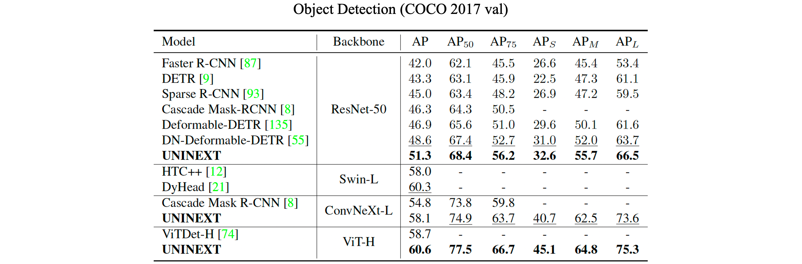
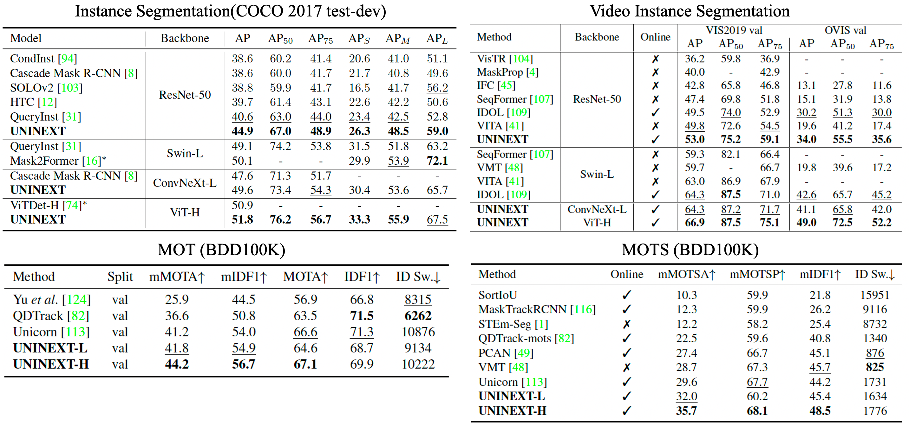
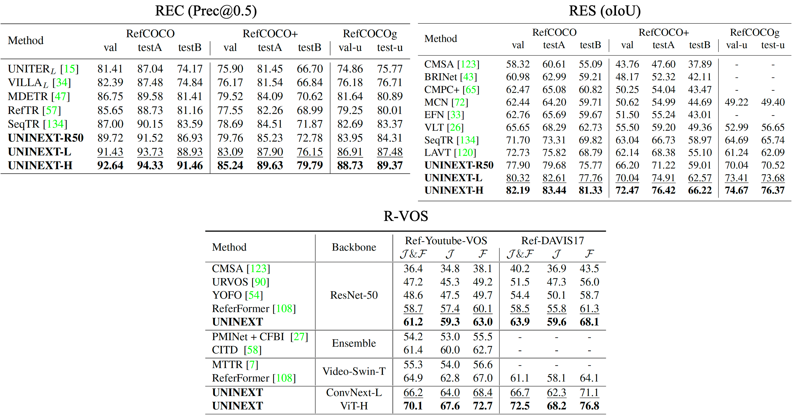
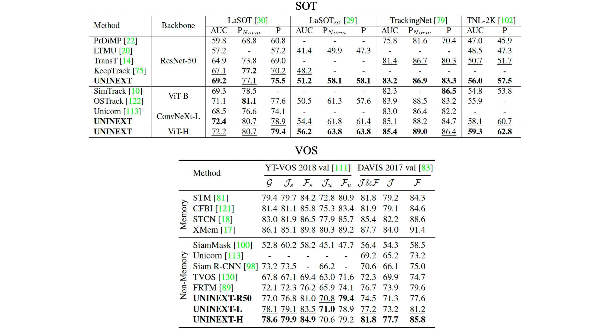
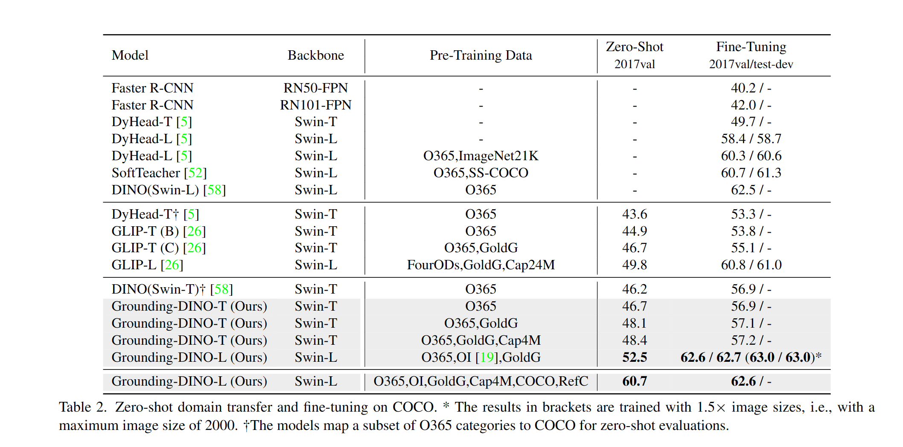
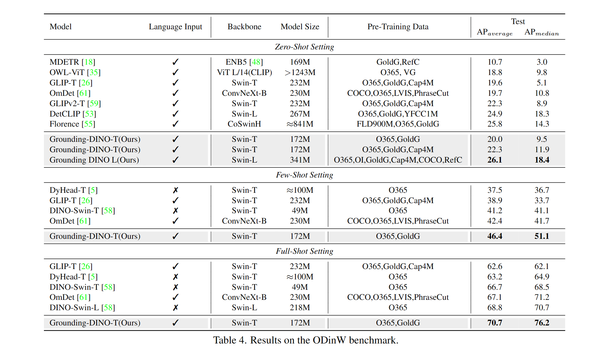

# Remote Sensing Resources

## Dataset
### Remote Sensing

|Name|Type|Total Data (Images)|Link|SOTA|
|---|---|---|---|---|
|DIOR-RSVG|Reference Segmentation|38,320|[Paper](https://arxiv.org/abs/2210.12634)|[RSVG](https://github.com/zhanyang-nwpu/rsvg-pytorch) (2022) [BERT, ResNet50, Transformer head]|
|iSAID|Object Detection|2,806|[Github](https://captain-whu.github.io/iSAID/), [Paper](https://arxiv.org/abs/1905.12886)|[PANet++](https://github.com/yeliudev/catnet) (2021) [ResNet + MaskRCNN]
|DIOR|Object Detection|23,463|[Website](https://gcheng-nwpu.github.io/#Datasets), [Paper](https://arxiv.org/ftp/arxiv/papers/1909/1909.00133.pdf)|[ViT-G12X4](https://paperswithcode.com/paper/a-billion-scale-foundation-model-for-remote/review/?hl=101435) (2023) [ViT + Proposed head]|
|SN6: Multi-Sensor All-Weather Mapping|Segmentations (Buildings)|48,000|[Website](https://spacenet.ai/sn6-challenge/)|[Unnamed](https://github.com/SpaceNetChallenge/SpaceNet_SAR_Buildings_Solutions/tree/master) (2020) [U-Net + EfficientNet]|
|HRSC2016|Object Detection (Ships)|1671|[Website](https://www.kaggle.com/datasets/guofeng/hrsc2016)|[LSKNet](https://github.com/zcablii/LSKNet) (2023) [Proposed Backbone + Attention Head]|

### General
|Name|Type|Label|Total Data (Images)|Link|SOTA|
|---|---|---|---|---|---|
|RefCOCO|Reference Segmentation|Phrase, Bounding, Segmentation|19,992|[Github], [Paper]|[UNINEXT-H](https://github.com/MasterBin-IIAU/UNINEXT) (2023) [BERT, ViT, Transformer Head]|

# Noteworthy Models
### 1. [UNINEXT](https://github.com/MasterBin-IIAU/UNINEXT) (2023) [Image + Phrase (Optional) -> Segment]
SOTA in [BDD100K](https://www.vis.xyz/bdd100k/), [COCO](https://cocodataset.org/), [DAVIS 2017](https://davischallenge.org/), [LaSOT](http://vision.cs.stonybrook.edu/~lasot/), [OVIS](http://songbai.site/ovis/), [RefCOCO & RefCOCO+](https://github.com/lichengunc/refer), [Refer-YouTube-VOS](https://youtube-vos.org/dataset/rvos/), [Segmentation in the Wild](https://eval.ai/web/challenges/challenge-page/1931/overview), [TNL2K](https://sites.google.com/view/langtrackbenchmark/), [TrackingNet](https://tracking-net.org/).

Backbone: `ResNet50`, `ConvNeXt-Large`, `ViT-Huge`, `BERT` 
3 Stage pretraining: 
1. Objects365 (General), 
2. COCO & RefCOCO (Image-joint)
3. OVIS, LaSOT, Ref-Youtube-VOS (Video-joint)

#### Results:
Retrieval by Category Names

Retrieval by Language Expressions

Retrieval by Target Annotations

### 2. [ReLA](https://github.com/henghuiding/ReLA) (2023) [Image -> Segment]

Backbone: `Swin-B`, `BERT`
Pretrained on modified RefCOCO dataset.

Proposed Region-Image and Region-Language Cross Attention to a map comprising P*P regions, which is utilized for the purpose of segmentation.

Demonstrated a notable capacity for contextual comprehension and logical reasoning. Nevertheless, due to its training on a RefCOCO dataset, it encounters challenges in accurately identifying objects when viewed from an aerial perspective.

### 3. [GroundingDINO](https://github.com/IDEA-Research/GroundingDINO) (2023) [Image + Phrase -> BBox]

SOTA in [MSCOCO Zero-shot](https://paperswithcode.com/sota/zero-shot-object-detection-on-mscoco) and [ODinWZero-shot](https://paperswithcode.com/sota/zero-shot-object-detection-on-odinw)

Backbone: `Swin-L`, `BERT`
Pretrained on: Objects365, OpenImage, GoldG, Cap4M, COCO, RefCOCO

Suggested enhancements involve the fusion of techniques from both the `GLIP` and `DETR` methodologies. This integration incorporates a Cross-Modality Decoder, which combines features extracted from both textual and image inputs. Furthermore, the utilization of object queries, reminiscent of the "DETR" approach, is refined through dynamic selection by the "Language-Guided Query Selection" network.

#### Results:
COCO Object Detection

ODinW Object Detection

### 4. [SAM](https://github.com/facebookresearch/segment-anything) (2023) [Image + Prompt (BBox / point) -> Segment]

Backbone: `ViT-H`, `BERT`
Pretrained on: `SA-1B`

Proposed a method of leveraging prompt for segmentation task, hence it can <i>"transfer zero-shot to new image distributions and tasks."</i> This approach harnesses substantial models and a substantial dataset (~11 million images) to extrapolate the segmentation task in a comprehensive manner.

